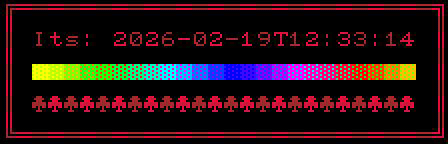

## AsciiDot

`AsciiDot` provides a node named `AsciiTerminal` which can be used to render a terminal.

Each character can have a foreground and background color.

Fonts can be found at [dwarffortresswiki.org/index.php/Tileset_repository](https://dwarffortresswiki.org/index.php/Tileset_repository).

This was a quick side project to create debug visualizations for another project.

### Installation

Copy the `addons` folder into your project.
You can ignore all other project files.
